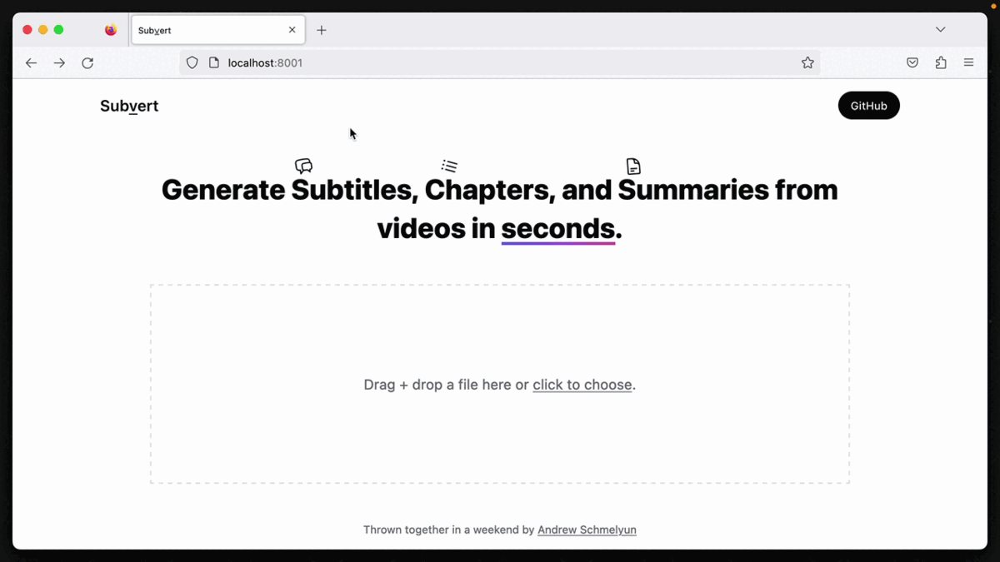

# Subvert

Ceci est une version du projet traduite en français. Les fonctions sont les mêmes et tout le mérite revient au créateur original.


Générez des sous-titres, des chapitres et des résumés de vidéos en quelques secondes avec l'aide d'OpenAI.

🚧 Ceci est encore largement en cours de développement, veuillez [créer des problèmes](https://github.com/aschmelyun/subvert/issues/new) pour les bugs s'ils apparaissent 🚧



## Pour commencer

Vous aurez besoin de :

- [Docker installé](https://docs.docker.com/get-docker/) sur votre machine locale
- Une [clé API OpenAI](https://platform.openai.com/account/api-keys)

Subvert est autonome dans une seule image Docker et peut être démarré avec une seule commande :

```
docker run -it -p 80:8080 -e OPENAI_API_KEY=sk-123abc aschmelyun/subvert
```

Cela démarrera un serveur exécutant l'application et la rendra disponible sur votre machine à l'adresse http://localhost.

## Comment ça fonctionne

Après avoir sélectionné un fichier vidéo à traiter, vous avez la possibilité de choisir si vous souhaitez également générer des chapitres et un résumé.

Votre vidéo est envoyée à une API où l'audio en est extrait à l'aide de FFMpeg, puis envoyée au modèle **Whisper d'OpenAI** pour une transcription au format vtt courant.

Si vous avez choisi de sélectionner des chapitres ou un résumé, cette transcription est ensuite envoyée à un modèle **ChatGPT** pour être transformée en chapitres concis de la longueur souhaitée et en un bref résumé qui pourrait s'insérer dans quelque chose comme une description YouTube.

## Configuration

Vous pouvez ajuster quelques paramètres dans le conteneur en passant des [variables d'environnement](https://docs.docker.com/engine/reference/commandline/run/#env) avec votre commande en utilisant des drapeaux supplémentaires `-e`. Voici les actuels que vous pouvez ajouter :

- `OPENAI_API_KEY` **(obligatoire)** - Définit la clé responsable de la communication avec les API d'OpenAI. Aucune valeur par défaut.
- `UPLOAD_MAX_FILESIZE` - Modifie le paramètre UPLOAD_MAX_FILESIZE de PHP. Par défaut : `256M`
- `MEMORY_LIMIT` - Modifie le paramètre MEMORY_LIMIT de PHP. Par défaut : `512M`

## Démarrage à partir de la source

Alternativement, si vous avez **PHP 8.1+** et **npm** installés sur votre machine locale, vous pouvez démarrer l'application directement à partir du code source.

Tout d'abord, clonez ce dépôt à l'emplacement souhaité. Ensuite, accédez au répertoire `src` et exécutez :

```
docker run -it -p 80:8080 -e OPENAI_API_KEY=sk-123abc aschmelyun/subvert
```


Cela démarrera un serveur exécutant l'application et la rendra disponible sur votre machine à l'adresse http://localhost.

## Comment ça fonctionne

Après avoir sélectionné un fichier vidéo à traiter, vous avez la possibilité de choisir si vous souhaitez également générer des chapitres et un résumé.

Votre vidéo est envoyée à une API où l'audio en est extrait à l'aide de FFMpeg, puis envoyée au modèle **Whisper d'OpenAI** pour une transcription au format vtt courant.

Si vous avez choisi de sélectionner des chapitres ou un résumé, cette transcription est ensuite envoyée à un modèle **ChatGPT** pour être transformée en chapitres concis de la longueur souhaitée et en un bref résumé qui pourrait s'insérer dans quelque chose comme une description YouTube.

## Configuration

Vous pouvez ajuster quelques paramètres dans le conteneur en passant des [variables d'environnement](https://docs.docker.com/engine/reference/commandline/run/#env) avec votre commande en utilisant des drapeaux supplémentaires `-e`. Voici les actuels que vous pouvez ajouter :

- `OPENAI_API_KEY` **(obligatoire)** - Définit la clé responsable de la communication avec les API d'OpenAI. Aucune valeur par défaut.
- `UPLOAD_MAX_FILESIZE` - Modifie le paramètre UPLOAD_MAX_FILESIZE de PHP. Par défaut : `256M`
- `MEMORY_LIMIT` - Modifie le paramètre MEMORY_LIMIT de PHP. Par défaut : `512M`

## Démarrage à partir de la source

Alternativement, si vous avez **PHP 8.1+** et **npm** installés sur votre machine locale, vous pouvez démarrer l'application directement à partir du code source.

Tout d'abord, clonez ce dépôt à l'emplacement souhaité. Ensuite, accédez au répertoire `src` et exécutez :

```
./startup.sh
```


Alternativement, vous pouvez exécuter les commandes à l'intérieur du script `startup.sh` individuellement pour obtenir le même résultat.

## Déploiement

Étant donné que ce projet est contenu dans un seul fichier Docker, il peut être déployé immédiatement sur n'importe quel serveur provisionné avec Docker. Alternativement, l'image Docker de Subvert peut être exécutée sur des instances cloud via AWS, Azure, GCP, Fly.io, etc.

> Remarque : Cette image expose actuellement uniquement le port http :80 non sécurisé.

## Licence

La Licence MIT (MIT). Veuillez consulter le [fichier de licence](LICENSE.md)
